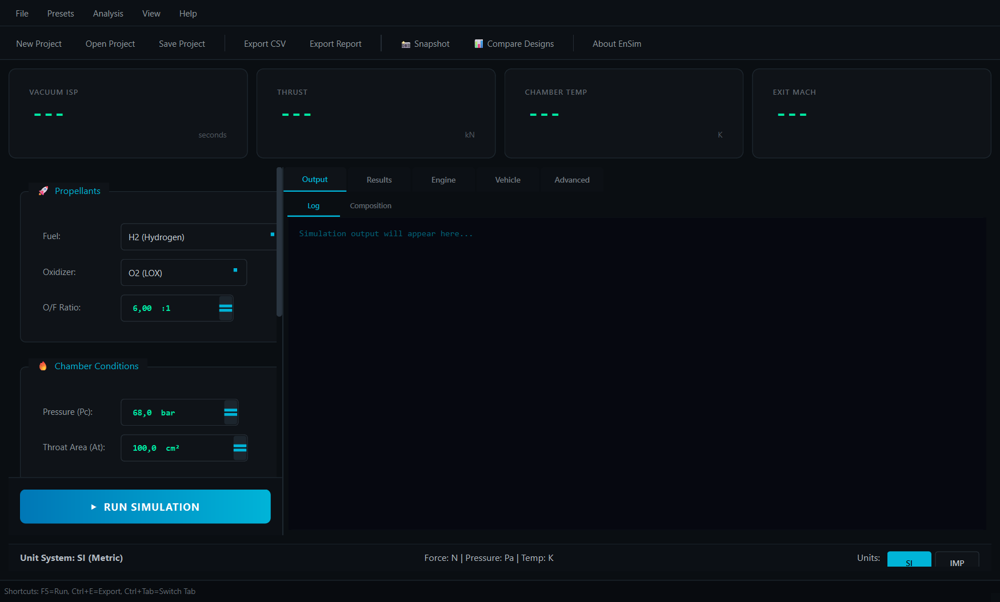

<p align="center">
  
</p>

<h1 align="center">EnSim</h1>
<h3 align="center">🚀 Professional Rocket Engine & Flight Simulation Platform</h3>

<p align="center">
  <a href="https://github.com/SpaceEngineerSS/EnSim/actions/workflows/ci.yml">
    
  </a>
  <a href="https://pypi.org/project/ensim/">
    
  </a>
  <a href="https://opensource.org/licenses/MIT">
    
  </a>
  <a href="https://www.python.org/">
    
  </a>
  <a href="docs/VALIDATION.md">
    
  </a>
</p>

<p align="center">
  <a href="#-features">Features</a> •
  <a href="#-quick-start">Quick Start</a> •
  <a href="#-documentation">Documentation</a> •
  <a href="#-validation">Validation</a> •
  <a href="#-contributing">Contributing</a>
</p>

---

## Overview

**EnSim** is an open-source desktop application for rocket propulsion analysis and flight simulation. It combines NASA-validated thermochemical equilibrium calculations with full 6-DOF trajectory simulation, all within a modern, user-friendly interface.

Whether you're a student learning rocket science, a researcher exploring propulsion concepts, or an engineer performing preliminary design analysis, EnSim provides the tools you need.

<p align="center">
  
</p>

## ✨ Features

### 🔬 Thermochemical Analysis
- **NASA CEA Methodology**: Gordon-McBride equilibrium solver with Gibbs free energy minimization
- **Comprehensive Species Database**: 35+ species including H₂, O₂, CH₄, RP-1, N₂O₄, UDMH, MMH
- **High-Temperature Dissociation**: Full accounting for H, O, OH, NO, and other radicals
- **Validated Accuracy**: <2% error vs NASA CEA reference data

### 🚀 Performance Calculations
- **Chamber Temperature**: Adiabatic flame temperature with dissociation
- **Characteristic Velocity (C*)**: Key measure of combustion efficiency
- **Specific Impulse (Isp)**: Both vacuum and sea-level values
- **Thrust Coefficient (Cf)**: With nozzle divergence corrections

### 🎯 6-DOF Flight Simulation
- **Full Rigid Body Dynamics**: Quaternion-based orientation (no gimbal lock)
- **Adaptive Integration**: RK45 Dormand-Prince with automatic step sizing
- **Aerodynamic Models**: Configurable drag and stability derivatives
- **Dense Output**: Cubic Hermite interpolation for smooth trajectories

### 🎲 Monte Carlo Analysis
- **Landing Dispersion**: CEP and 3-sigma confidence ellipses
- **Performance Variability**: Statistical analysis of Isp, thrust, burn time
- **Parallel Processing**: Multi-core execution for thousands of runs
- **Visualization**: Scatter plots, histograms, and probability contours

### 🎨 Modern User Interface
- **Mission Control Aesthetic**: SpaceX-inspired dark theme with neon accents
- **Real-time KPI Dashboard**: Live display of key performance metrics
- **Interactive 3D Visualization**: PyVista-powered nozzle and trajectory display
- **Professional Exports**: CSV data, Markdown reports, STL/OBJ/PLY 3D models

## 🚀 Quick Start

### Prerequisites

- Python 3.10 or higher
- pip package manager

### Installation

#### Option 1: Install from PyPI (Recommended)

```bash
pip install ensim
```

#### Option 2: Install from Source

```bash
# Clone the repository
git clone https://github.com/SpaceEngineerSS/EnSim.git
cd EnSim

# Create virtual environment (recommended)
python -m venv venv

# Activate virtual environment
# Windows:
venv\Scripts\activate
# Linux/macOS:
source venv/bin/activate

# Install dependencies
pip install -r requirements.txt
```

### Running EnSim

```bash
# Launch the GUI application
python main.py

# Run with validation tests
python main.py --test
```

### First Simulation

1. **Select Propellants**: Choose fuel (e.g., H₂) and oxidizer (e.g., O₂)
2. **Set Conditions**: Enter O/F ratio, chamber pressure, expansion ratio
3. **Run Simulation**: Click "RUN SIMULATION" to calculate performance
4. **Analyze Results**: View KPIs, graphs, and 3D nozzle visualization

## 📖 Documentation

| Document | Description |
|----------|-------------|
| [ARCHITECTURE.md](ARCHITECTURE.md) | System design and physics overview |
| [docs/THEORY.md](docs/THEORY.md) | Mathematical formulation and equations |
| [docs/VALIDATION.md](docs/VALIDATION.md) | NASA CEA comparison results |
| [CONTRIBUTING.md](CONTRIBUTING.md) | Contribution guidelines |
| [CHANGELOG.md](CHANGELOG.md) | Version history |

## ✅ Validation

EnSim is rigorously validated against NASA CEA, the industry standard for rocket propulsion analysis.

### Validation Summary

| Propellant Combination | T_chamber Error | Isp Error | Status |
|------------------------|-----------------|-----------|--------|
| LOX/LH₂ | 1.76% | 1.41% | ✅ Pass |
| LOX/CH₄ | 0.48% | 1.07% | ✅ Pass |
| LOX/RP-1 | 0.49% | 0.86% | ✅ Pass |
| N₂O₄/UDMH | 0.56% | 0.85% | ✅ Pass |

**Overall Accuracy**: Average error <1% across all validated cases

See [VALIDATION.md](docs/VALIDATION.md) for detailed comparison data.

## 🏗️ Architecture

```
EnSim/
├── 📁 src/
│   ├── 📁 core/                 # Physics Engine (Numba JIT)
│   │   ├── chemistry.py         # Gibbs equilibrium solver
│   │   ├── propulsion.py        # Nozzle flow calculations
│   │   ├── flight_6dof.py       # 6-DOF dynamics
│   │   ├── integrators.py       # RK45, Hermite interpolation
│   │   ├── monte_carlo.py       # Dispersion analysis
│   │   └── thermodynamics.py    # NASA polynomial evaluation
│   │
│   ├── 📁 ui/                   # User Interface (PyQt6)
│   │   ├── windows/             # Main window, dialogs
│   │   ├── widgets/             # Custom widgets
│   │   └── workers.py           # Background threads
│   │
│   └── 📁 utils/                # Utilities
│       ├── nasa_parser.py       # Thermo data parser
│       └── exporters.py         # Data export functions
│
├── 📁 data/                     # NASA thermodynamic database
├── 📁 tests/                    # Test suite (pytest)
├── 📁 docs/                     # Documentation
└── 📁 assets/                   # Icons, stylesheets
```

## 🔧 Technology Stack

| Component | Technology | Purpose |
|-----------|------------|---------|
| GUI | PyQt6 | Modern cross-platform interface |
| Numerics | NumPy, SciPy | Array operations, optimization |
| Acceleration | Numba | JIT compilation for 10-100x speedup |
| 3D Visualization | PyVista | Interactive nozzle/trajectory display |
| 2D Plots | Matplotlib | Scientific plotting |
| Testing | pytest | Unit and validation tests |

## 🤝 Contributing

We welcome contributions from the community! Whether it's:

- 🐛 **Bug Reports**: Found an issue? [Open a bug report](../../issues/new?template=bug_report.yml)
- ✨ **Feature Requests**: Have an idea? [Suggest a feature](../../issues/new?template=feature_request.yml)
- 🔬 **Scientific Issues**: Validation concerns? [Report a scientific issue](../../issues/new?template=scientific_issue.yml)
- 💻 **Code Contributions**: Ready to code? See [CONTRIBUTING.md](CONTRIBUTING.md)

### Development Setup

```bash
# Install development dependencies
pip install -e ".[dev]"

# Run tests
pytest tests/ -v

# Run linting
ruff check src/

# Format code
black src/ tests/
```

## 📜 License

This project is licensed under the MIT License - see [LICENSE](LICENSE) for details.

## 🙏 Acknowledgments

- **NASA Glenn Research Center** - Thermodynamic polynomial database
- **Sutton & Biblarz** - "Rocket Propulsion Elements" reference
- **The open-source scientific Python community** - NumPy, SciPy, Matplotlib

## 📚 References

1. Gordon, S. & McBride, B.J. (1994). *"Computer Program for Calculation of Complex Chemical Equilibrium Compositions and Applications"*. NASA Reference Publication 1311.

2. McBride, B.J., Zehe, M.J., & Gordon, S. (2002). *"NASA Glenn Coefficients for Calculating Thermodynamic Properties of Individual Species"*. NASA/TP-2002-211556.

3. Sutton, G.P. & Biblarz, O. (2017). *"Rocket Propulsion Elements"*. 9th Edition, Wiley.

4. Anderson, J.D. (2003). *"Modern Compressible Flow"*. 3rd Edition, McGraw-Hill.

---

<p align="center">
  Made with ❤️ for the aerospace community
</p>

<p align="center">
  <a href="#ensim">⬆️ Back to top</a>
</p>
