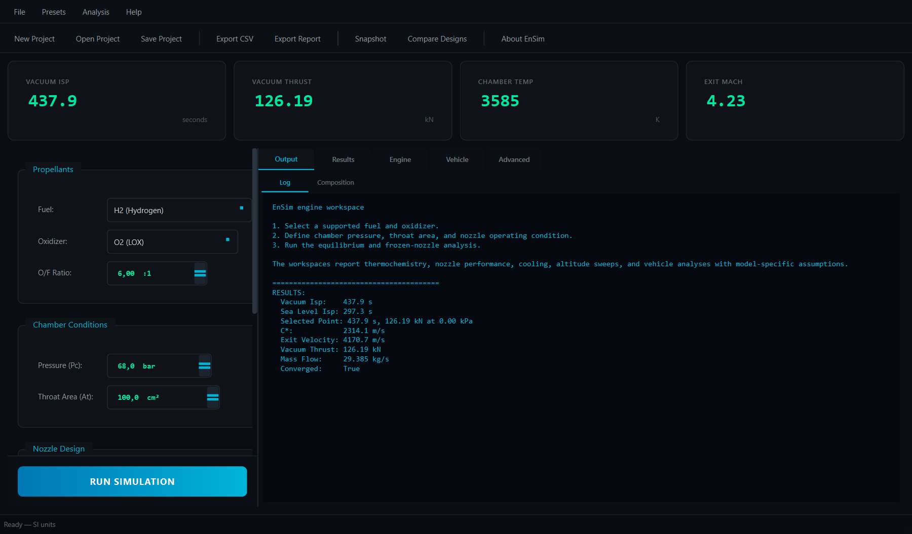

# EnSim

EnSim is an open-source desktop application and Python package for liquid-rocket
propulsion analysis and six-degree-of-freedom flight simulation. It is intended
for preliminary design, reproducible trade studies and engineering education.

[](https://github.com/SpaceEngineerSS/EnSim/actions/workflows/ci.yml)
[](https://pypi.org/project/ensim/)
[](https://pypi.org/project/ensim/)
[](LICENSE)



## What EnSim calculates

- ideal-gas chemical equilibrium by constrained Gibbs-energy minimization;
- adiabatic chamber temperature from coupled equilibrium and enthalpy balance;
- frozen-composition, calorically perfect nozzle performance;
- planar minimum-length method-of-characteristics nozzle contours;
- preliminary regenerative-cooling heat transfer and pressure loss;
- acoustic chamber-mode frequencies, with stability classification only when
  growth and damping rates are supplied;
- local-frame and WGS-84/J2 six-degree-of-freedom trajectories;
- staging, dispersion analysis, reduced-order optimization and uncertainty
  propagation.

The interface uses SI units. Long-running engine, flight and uncertainty jobs run
outside the GUI event loop. Project files remain local; the application does not
require a network connection.

## Scientific status

EnSim distinguishes verification from validation:

- thermodynamic polynomial evaluation, conservation equations and nozzle
  relations have analytical or invariant tests;
- two gas-phase HP equilibrium cases are compared with results produced by the
  official NASA CEA 3.3.2 Python distribution;
- dragless WGS-84 translation and torque-free rotation are compared with
  selected public NASA NESC check-case histories;
- cooling correlations are checked against their equations and physical trends,
  but are not calibrated to a particular engine hot-fire data set;
- the general aerodynamic flight model has not been validated against telemetry.
- axial flight drag uses an explicit user-supplied coefficient rather than an
  undocumented synthetic Mach curve.

See [validation](docs/VALIDATION.md), [model limitations](docs/MODEL_LIMITATIONS.md)
and [theory](docs/THEORY.md) before using results in a design decision. EnSim is
not a certification, range-safety or hardware-release tool.

## Installation

### Desktop downloads

Self-contained downloads that do not require a separate Python installation are
available on the [GitHub Releases page](https://github.com/SpaceEngineerSS/EnSim/releases/latest):

- Windows x64 executable (`.exe`);
- Linux x86-64 executable archive (`.tar.gz`);
- macOS disk images (`.dmg`) for Apple Silicon and Intel.

Each desktop file has a matching `.sha256` checksum. The current Windows and
macOS builds are not code-signed, so the operating system may ask for explicit
confirmation before the first launch.

### Python package

Python 3.10 or newer is required.

```bash
python -m pip install ensim
ensim
```

For a source checkout:

```bash
git clone https://github.com/SpaceEngineerSS/EnSim.git
cd EnSim
python -m venv .venv
python -m pip install -e ".[dev,docs]"
python -m pytest
python main.py
```

The command `ensim --test` performs a short installation and coupled-physics
smoke test. It is not a substitute for the complete pytest suite.

## Minimal Python example

```python
from ensim.core.chemistry import CombustionProblem
from ensim.core.propulsion import NozzleConditions, calculate_performance
from ensim.utils.nasa_parser import load_default_database

database = load_default_database()
problem = CombustionProblem(database)
problem.add_fuel("H2", moles=2.0, temperature=298.15)
problem.add_oxidizer("O2", moles=1.0, temperature=298.15)
equilibrium = problem.solve(pressure=6.89e6)

nozzle = NozzleConditions(
    area_ratio=40.0,
    chamber_pressure=6.89e6,
    ambient_pressure=0.0,
)
performance = calculate_performance(
    T_chamber=equilibrium.temperature,
    P_chamber=nozzle.chamber_pressure,
    gamma=equilibrium.gamma,
    mean_molecular_weight=equilibrium.mean_molecular_weight,
    nozzle=nozzle,
)

print(equilibrium.temperature, performance.isp)
```

`mean_molecular_weight` is expressed in g/mol; pressures are Pa and
temperatures are K.

## Documentation

- [Architecture](ARCHITECTURE.md)
- [Theory and equations](docs/THEORY.md)
- [Validation evidence](docs/VALIDATION.md)
- [Flight verification](docs/FLIGHT_VALIDATION.md)
- [Cooling model](docs/COOLING.md)
- [Combustion-instability model](docs/COMBUSTION_INSTABILITY.md)
- [Uncertainty quantification](docs/UNCERTAINTY_QUANTIFICATION.md)
- [API overview](docs/api/index.md)

## Development

```bash
python -m ruff check src tests
python -m pytest
python -m build
python -m twine check dist/*
```

Bug reports and scientific challenges are welcome through the
[issue tracker](https://github.com/SpaceEngineerSS/EnSim/issues). A scientific
issue should include units, full input data, the reference source and enough
information to reproduce the comparison.

## Primary references

1. Gordon, S. and McBride, B. J., *Computer Program for Calculation of Complex
   Chemical Equilibrium Compositions and Applications, Part I: Analysis*, NASA
   RP-1311, 1994.
2. McBride, B. J., Zehe, M. J. and Gordon, S., *NASA Glenn Coefficients for
   Calculating Thermodynamic Properties of Individual Species*,
   NASA/TP-2002-211556, 2002.
3. Jackson, E. B., Murri, D. G. and Shelton, R. O., *Check-Cases for
   Verification of 6-Degree-of-Freedom Flight Vehicle Simulations, Volume I*,
   NASA/TM-2015-218675, 2015.
4. Bartz, D. R., *A Simple Equation for Rapid Estimation of Rocket Nozzle
   Convective Heat Transfer Coefficients*, Jet Propulsion, 1957.
5. Gordon, S. and McBride, B. J., *Computer Program for Calculation of Complex
   Chemical Equilibrium Compositions and Applications, Part II: Users Manual
   and Program Description*, NASA RP-1311, 1996.

## License and citation

EnSim is released under the [MIT License](LICENSE). Citation metadata is
available in [CITATION.cff](CITATION.cff).
