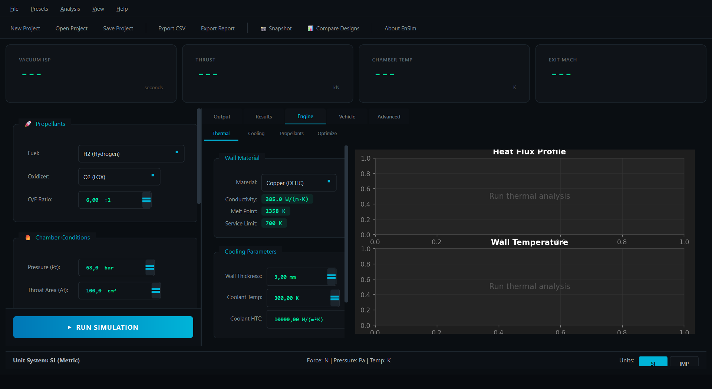

# User Guide

Welcome to the EnSim User Guide! This comprehensive guide covers all features of the application.

## Interface Overview

EnSim features a modern "Mission Control" style interface with cyan and green neon accents:

### Main Components

1. **Input Panel** (Left): Propellant selection and engine parameters
2. **KPI Dashboard** (Top): Real-time performance metrics
3. **Tab Navigation** (Center): Output, Results, Engine, Vehicle, Advanced
4. **Status Bar** (Bottom): Simulation status and messages

### Tab Overview

| Tab | Description |
|-----|-------------|
| **Output** | Main simulation output and KPI dashboard |
| **Results** | 2D graphs and 3D visualization |
| **Engine** | Thermal analysis, cooling design, optimization |
| **Vehicle** | Multi-stage configuration and flight simulation |
| **Advanced** | MOC nozzle design, Monte Carlo analysis |

#### Results Tab

#### Engine Tab (Thermal & Cooling)

#### Vehicle Tab (Multi-Stage)

#### 3D Visualization

## Guides

-   :material-flask:{ .lg .middle } __Propellant Selection__

    ---

    Choose and configure fuel/oxidizer combinations.

    [:octicons-arrow-right-24: Propellants](propellants.md)

-   :material-engine:{ .lg .middle } __Engine Design__

    ---

    Configure chamber conditions and nozzle geometry.

    [:octicons-arrow-right-24: Engine Design](engine-design.md)

-   :material-airplane:{ .lg .middle } __Flight Simulation__

    ---

    Run 6-DOF trajectory simulations.

    [:octicons-arrow-right-24: Flight Simulation](flight-simulation.md)

-   :material-dice-multiple:{ .lg .middle } __Monte Carlo Analysis__

    ---

    Statistical dispersion analysis.

    [:octicons-arrow-right-24: Monte Carlo](monte-carlo.md)

-   :material-export:{ .lg .middle } __Data Export__

    ---

    Export results to CSV, reports, and 3D models.

    [:octicons-arrow-right-24: Export](export.md)

## Quick Reference

### Keyboard Shortcuts

| Shortcut | Action |
|----------|--------|
| `Ctrl+N` | New Project |
| `Ctrl+O` | Open Project |
| `Ctrl+S` | Save Project |
| `Ctrl+R` | Run Simulation |
| `F5` | Run Simulation |
| `Ctrl+E` | Export Results |

### Supported Propellants

| Fuel | Oxidizer | Application |
|------|----------|-------------|
| H₂ | O₂ | High-performance upper stages |
| CH₄ | O₂ | Reusable rockets (Raptor-style) |
| RP-1 | O₂ | First stages (Merlin-style) |
| N₂H₄ | N₂O₄ | Storable propellants (spacecraft) |
| MMH | N₂O₄ | Reaction control systems |

### Typical Parameter Ranges

| Parameter | Typical Range |
|-----------|---------------|
| Chamber Pressure | 1-30 MPa |
| O/F Ratio | 1.5-8.0 |
| Expansion Ratio | 10-300 |
| Chamber Temperature | 2500-3700 K |

## Tips & Best Practices

!!! tip "Start Simple"
    Begin with standard propellant combinations (LOX/LH₂, LOX/RP-1) before exploring exotic options.

!!! tip "Validate Results"
    Compare your results against NASA CEA for verification.

!!! warning "High Expansion Ratios"
    Very high expansion ratios (>100) are sensitive to numerical precision. Consider sea-level flow separation.

