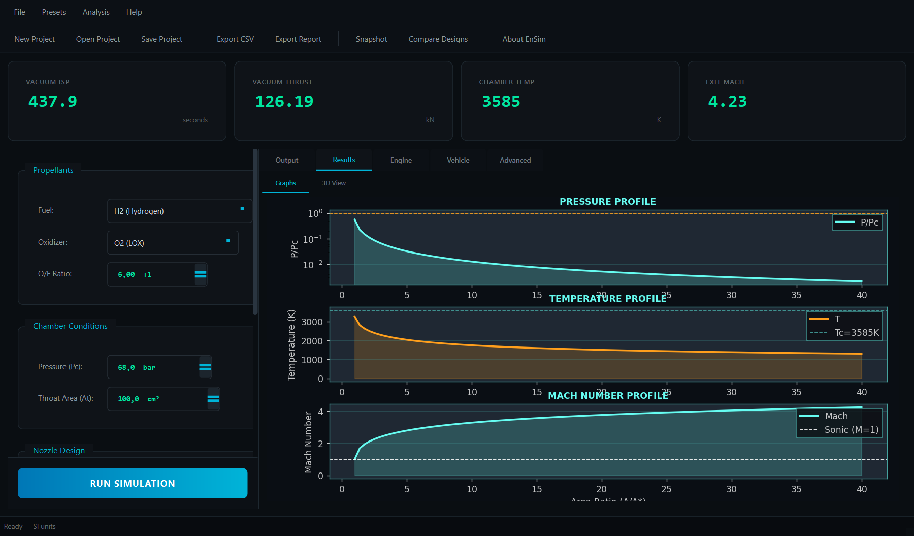
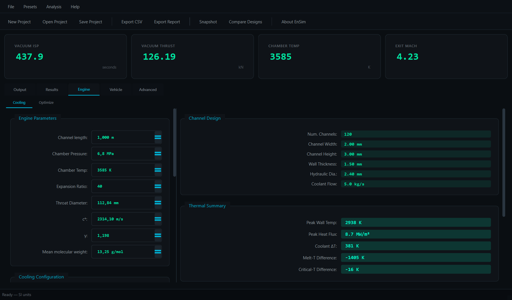
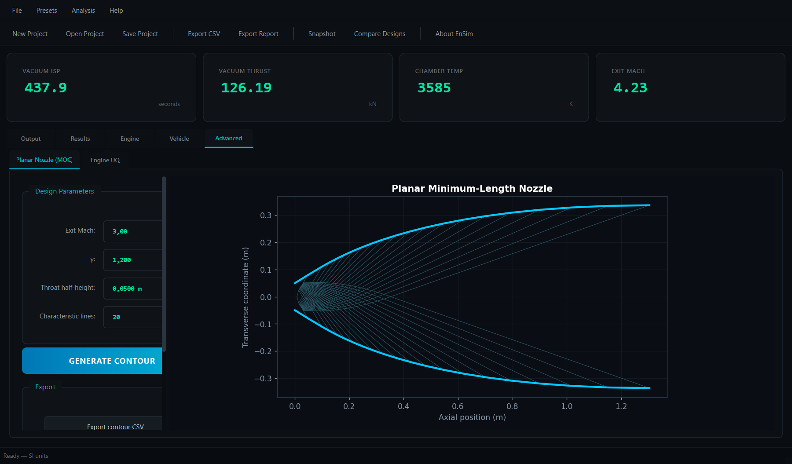
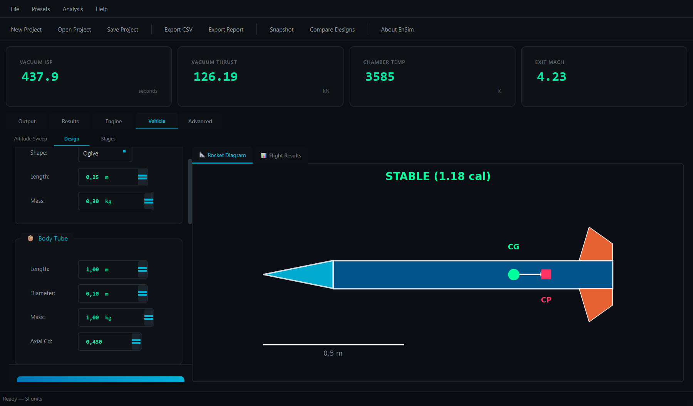
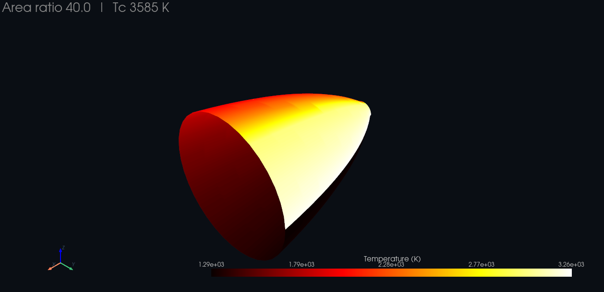

# Desktop user guide

## Engine workflow

The contextual input panel collects propellants, mass O/F ratio, chamber and
ambient pressure, expansion ratio, throat diameter and explicit efficiency
inputs. Run calculates equilibrium first and then the selected frozen ideal
nozzle operating point. Output presents convergence and key values; Results
contains station plots and the optional 3-D view.

## Engine specialist tabs

- **Thermal/cooling** uses the current chamber result together with explicitly
  entered channel geometry, coolant, wall material and correlation inputs.
- **Optimization** exposes reduced-order nozzle, staging, trajectory and load
  objectives. Constraints shown in the form are the constraints enforced.
- **Advanced / MOC** designs a symmetric planar minimum-length contour under
  steady, inviscid, irrotational and calorically perfect assumptions. Its
  transverse input is throat half-height, not an axisymmetric radius.
- **Advanced / Engine UQ** propagates the displayed uncertainty model and reports
  valid and failed runs.

## Vehicle and flight

Configure the vehicle before running flight or dispersion analysis. Flight uses
the engine mass flow and available propellant to determine cutoff. The optional
WGS-84 path returns ECI, local ENU and geodetic histories. The general
aerodynamic model is preliminary; consult
[flight verification](../FLIGHT_VALIDATION.md).

## Three-dimensional view

The 3-D view revolves the selected nozzle contour and colors its surface with the
one-dimensional station result. It is not a CFD solution or conjugate thermal
analysis.

## Projects and exports

Project files store local JSON parameters and contain no executable code. CSV and
Markdown exports preserve SI units in their headers. The Markdown report states
the idealized model boundary. Snapshot comparison is for design-state comparison,
not experimental uncertainty.

## Interpreting warnings

- A convergence failure invalidates downstream nozzle performance.
- Overexpansion is a warning that the attached-flow model may be inappropriate.
- A cooling result outside a correlation domain should be rejected, not
  extrapolated silently.
- Acoustic frequency proximity is not proof of instability.
- Monte Carlo confidence is conditional on the selected input distributions.

## Units

The current interface and computational core use SI. Do not interpret labels as
converted Imperial values; the former cosmetic unit toggle was removed.
